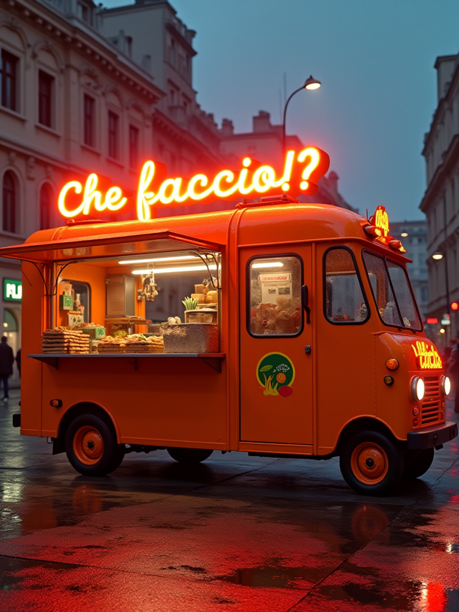
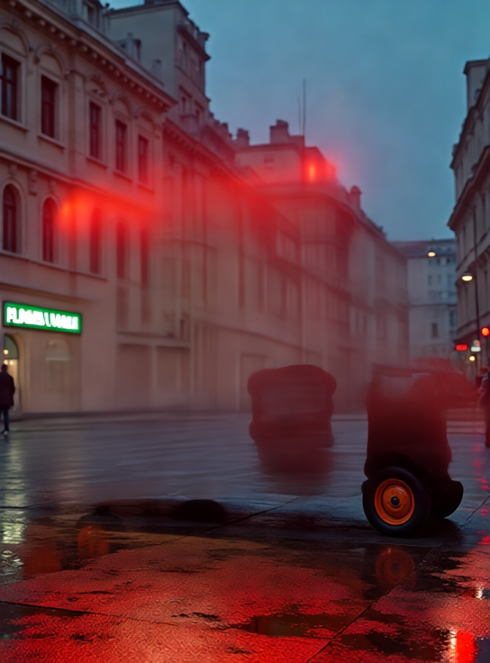
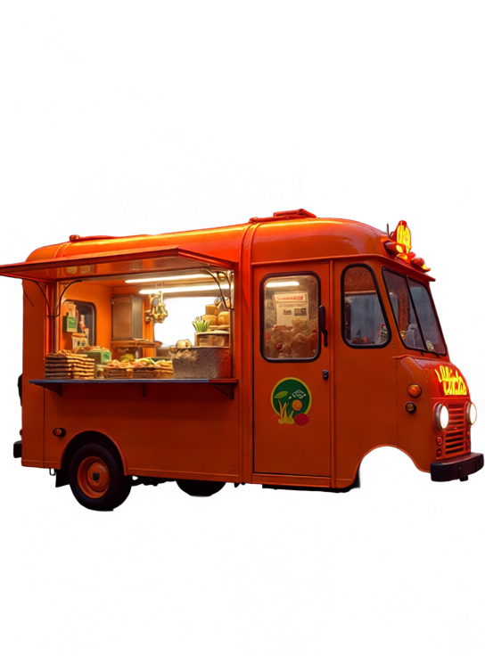
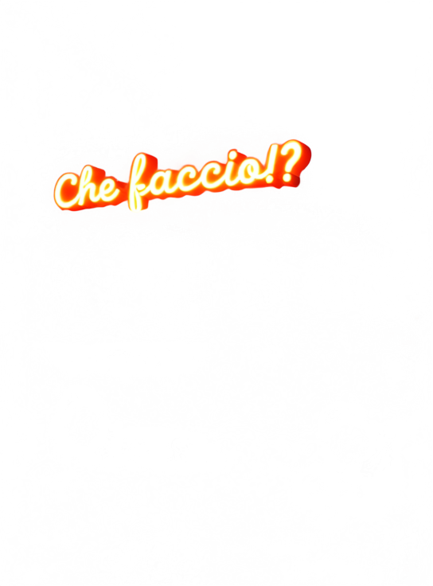
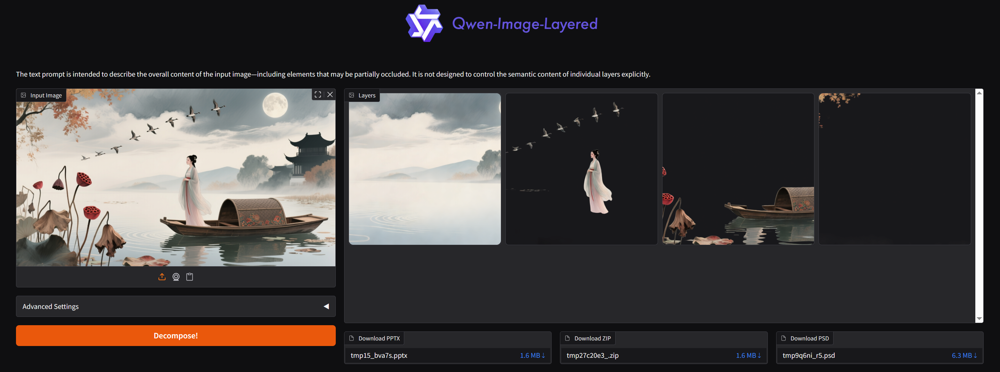
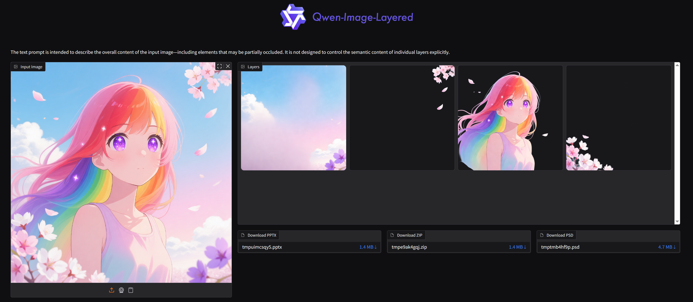
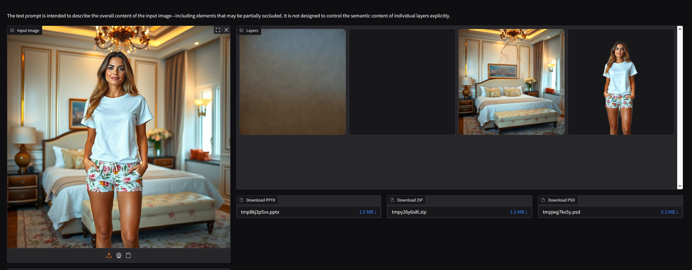
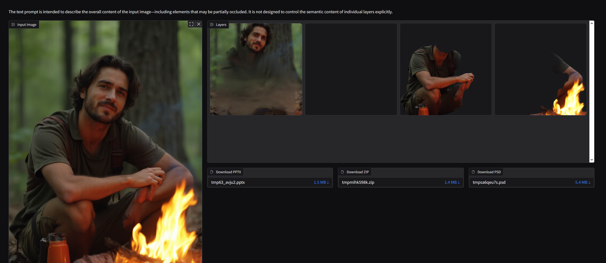
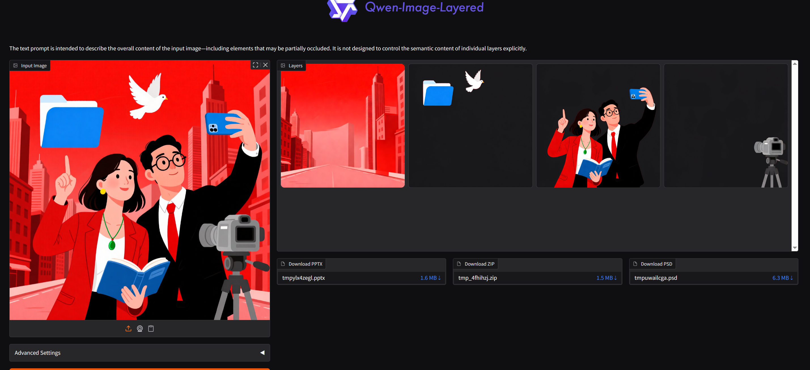

# Qwen-Image-Layered — Local Setup Guide (Windows)


> Guida completa per far girare **Qwen-Image-Layered** in locale su Windows con GPU NVIDIA.
> Zero cloud. Zero API. Un browser.

[](https://opensource.org/licenses/Apache-2.0)
[](https://www.python.org/downloads/)
[](https://developer.nvidia.com/cuda-toolkit)
[](https://huggingface.co/Qwen/Qwen-Image-Layered)

---

## Cos'è Qwen-Image-Layered

**Qwen-Image-Layered** è un modello di Alibaba/Qwen capace di decomporre qualsiasi immagine in layer RGBA separati — esattamente come farebbe un artista in Photoshop, ma in modo completamente automatico.

Per chi lavora in **VFX, motion graphics o post-produzione**: separazione automatica di elementi, maschere alpha pronte all'uso, layer indipendenti su cui fare editing.

Secondo me c'è ancora molto da migliorare e capire come funziona ma è un incredibile punto di partenza.
Su immagini dove i "bordi" sono ben definiti non ci sono grossi dubbi sul funzionamento. Il problema nasce quando ci sono immagine meno "vettoriali" e più "realistiche".

Tutte le immagini non presenti negli esempi del repo di Qwen, sono state generate tramite Comfyui.

Output supportati: **PNG · ZIP · PPTX · PSD**

---

## Gallery — Esempi reali

Tutti i risultati qui sotto sono stati generati localmente su RTX 3090, con `device_map="balanced"`.

### Food Truck — 4 layer
| Input | Layer 1 — Sfondo | Layer 2 — Truck | Layer 3 — Scritta neon |
|-------|-----------------|-----------------|----------------------|
|  |  |  |  |

> Immagine generata con FLUX su ComfyUI. Il modello ha separato sfondo urbano, truck e scritta neon in layer distinti senza nessuna maschera manuale.

---

### Paesaggio Cinese — 4 layer


> Separazione notevole: cielo/acqua come sfondo, uccelli in volo come layer indipendente, figura umana, barca con fiori in primo piano. Quattro elementi semanticamente distinti isolati automaticamente.

---

### Anime Girl — 4 layer


> Cielo degradato, petali di ciliegio, personaggio principale, fiori in primo piano — layer puliti con alpha precisa anche sui capelli.

---

### Fashion / E-commerce — 3 layer


> Caso d'uso immediato: sfondo neutro, ambiente (camera), persona ritagliata. Pronto per sostituire il background o riutilizzare il soggetto su altre scene.

---

### Uomo al Fuoco — 4 layer


> Il più interessante: foresta sfocata, figura umana, fuoco isolato come layer separato.

---

### Business Illustration — 4 layer


> Funziona anche su illustrazioni flat/vettoriali: sfondo rosso, personaggi, oggetti iconici (cartella, colomba, telecamera) separati con precisione.

---

## Hardware utilizzato

| Componente | Specifiche |
|-----------|-----------|
| GPU | NVIDIA GeForce RTX 3090 (24GB VRAM) |
| CPU | AMD Ryzen Threadripper 3970X |
| RAM | 256GB |
| OS | Windows 11 |
| Storage | Disco D: dedicato (~80GB necessari) |

---

## Prerequisiti

- Python 3.10 installato
- Git + Git LFS installati
- Driver NVIDIA aggiornati (CUDA 12.x)
- ~80GB liberi su disco

---

## Setup completo

### FASE 1 — Struttura cartelle

Apri **cmd come amministratore**:

```cmd
mkdir D:\AI\Qwen-Image-Layered
mkdir D:\AI\Qwen-Image-Layered\model
mkdir D:\AI\Qwen-Image-Layered\output
```

---

### FASE 2 — Virtual Environment Python

```cmd
cd D:\AI\Qwen-Image-Layered
python -m venv venv
venv\Scripts\activate
```

**Regola d'oro:** ogni volta che apri un nuovo cmd, prima di qualsiasi operazione:
```cmd
cd D:\AI\Qwen-Image-Layered
venv\Scripts\activate
```
Il prompt deve mostrare `(venv)`. Verifica con `where python` — deve rispondere con il path dentro `D:\AI\Qwen-Image-Layered\venv\`.

---

### FASE 3 — Installazione dipendenze

```cmd
pip install torch torchvision torchaudio --index-url https://download.pytorch.org/whl/cu121
pip install git+https://github.com/huggingface/diffusers.git
pip install transformers accelerate huggingface_hub sentencepiece protobuf
pip install gradio python-pptx psd-tools
```

---

### FASE 4 — Download del modello (57GB)

Il metodo più affidabile su Windows è **git lfs**, che gestisce correttamente il resume:

```cmd
git lfs install
git clone https://huggingface.co/Qwen/Qwen-Image-Layered D:\AI\Qwen-Image-Layered\model
```

Se il download si interrompe:
```cmd
cd D:\AI\Qwen-Image-Layered\model
git lfs pull
```

> ⚠️ **Nota:** `snapshot_download` di huggingface_hub non gestisce bene il resume su Windows con il sistema xet — ogni interruzione riparte da zero. `git lfs` è molto più robusto.

---

### FASE 5 — Clone del repo UI

```cmd
cd D:\AI\Qwen-Image-Layered
git clone https://github.com/QwenLM/Qwen-Image-Layered.git repo
```

---

### FASE 6 — Verifica installazione

```cmd
python check.py
```

Output atteso:
```
File trovati: ~76
Dimensione totale: ~57 GB
CUDA disponibile: True
GPU: NVIDIA GeForce RTX 3090
```

---

### FASE 7 — Configurazione app.py

Copia il file `app.py` di questa repo sovrascrivendo quello originale:

```cmd
copy app.py D:\AI\Qwen-Image-Layered\repo\src\app.py
```

Le modifiche chiave rispetto all'originale:

**Path locale del modello:**
```python
MODEL_PATH = r"D:\AI\Qwen-Image-Layered\model"
ASSETS_PATH = r"D:\AI\Qwen-Image-Layered\repo\assets\test_images"
```

**device_map="balanced" invece di .to("cuda"):**
```python
pipeline = QwenImageLayeredPipeline.from_pretrained(
    MODEL_PATH,
    torch_dtype=torch.bfloat16,
    device_map="balanced"
)
```

> `device_map="balanced"` distribuisce i layer tra VRAM (24GB) e RAM (256GB), evitando OOM e il conflitto di device che si verifica con `enable_model_cpu_offload()`.

**Accesso da LAN** — già incluso:
```python
demo.launch(server_name="0.0.0.0", server_port=7869)
```

Apri la porta nel firewall:
```cmd
netsh advfirewall firewall add rule name="Qwen-Image-Layered" dir=in action=allow protocol=TCP localport=7869
```

---

### FASE 8 — Lancio

Doppio click su `AVVIA.bat` oppure:

```cmd
cd D:\AI\Qwen-Image-Layered
venv\Scripts\activate
python repo\src\app.py
```

Apri il browser su `http://localhost:7869`
Da altri PC in LAN: `http://[IP_DEL_PC]:7869`

---

## Tempi di inferenza reali

RTX 3090 24GB · 256GB RAM · `device_map="balanced"` · ComfyUI chiuso

| Steps | Layer | Tempo |
|-------|-------|-------|
| 20 | 2 | ~7 min |
| 50 | 2 | ~14 min |
| 20 | 4 | ~14 min |
| 50 | 4 | ~35 min |

---

## Problemi incontrati e soluzioni

### Download interrotto che riparte da zero
`snapshot_download` con il sistema xet di HuggingFace non gestisce il resume su Windows.
**Soluzione:** usare `git lfs clone`.

### VRAM insufficiente — tempi enormi (354s/step)
Con altri processi GPU attivi (es. ComfyUI) la VRAM era satura.
**Soluzione:** chiudere tutti i processi GPU prima di lanciare + `device_map="balanced"`.

### `enable_model_cpu_offload()` lento
Crea un conflitto di device (`input_ids` su CUDA, modello su CPU).
**Soluzione:** `device_map="balanced"` è più efficiente perché distribuisce staticamente i layer.

### `huggingface-cli` non trovato nel venv
**Soluzione:** usare `python -m huggingface_hub.commands.huggingface_cli` oppure `snapshot_download` via Python.

### `device_map="auto"` non supportato
Diffusers supporta solo: `balanced`, `cuda`, `cpu`.
**Soluzione:** usare `balanced`.

---

## Struttura del repo

```
Qwen-Image-Layered-Local-Setup/
│
├── README.md
├── app.py                     ← versione modificata per uso locale
├── AVVIA.bat                  ← launcher doppio click
├── check.py                   ← verifica installazione
│
├── examples/
│   ├── input/                 ← immagini originali usate nei test
│   └── output/                ← screenshot dei risultati
│
└── assets/
    └── comfyui_workflow.json  ← workflow FLUX usato per generare le immagini di test
```

---

## Link utili

- 🤗 [Modello su HuggingFace](https://huggingface.co/Qwen/Qwen-Image-Layered)
- 💻 [Repo ufficiale Qwen](https://github.com/QwenLM/Qwen-Image-Layered)
- 📑 [Paper ArXiv](https://arxiv.org/abs/2512.15603)
- 🎮 [Demo online](https://huggingface.co/spaces/Qwen/Qwen-Image-Layered)

---

## Licenza

Qwen-Image-Layered è rilasciato sotto licenza **Apache 2.0** — uso commerciale consentito.

---

*Testato su Windows 11 · Python 3.10 · PyTorch 2.5.1+cu121 · Diffusers 0.37.0.dev · RTX 3090 24GB*

*Guida realizzata da [Giuseppe](https://github.com/Innekstasy)*
